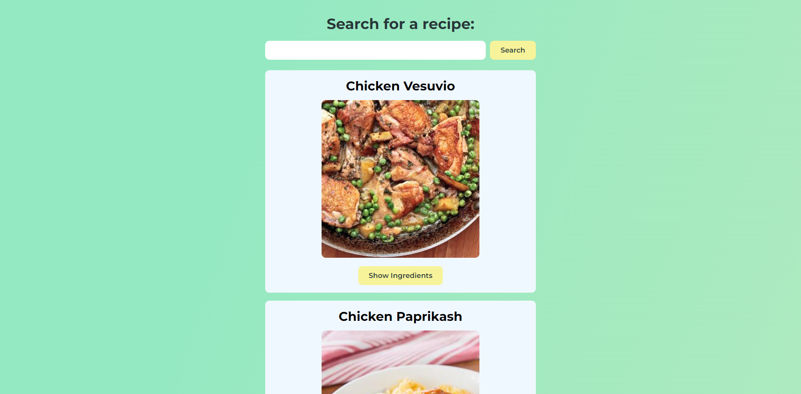

# Food Recipe App

Project inspired by the video [Build a Recipe App With React](https://www.youtube.com/watch?v=U9T6YkEDkMo&ab_channel=developedbyed) by [developedbyed](https://www.youtube.com/@developedbyed).

## Link

- [Project URL](https://food-recipe-website-react.netlify.app/) (hosted on Netlify)

## Screenshot

## Project

Users should be able to:

- Search for a recipe
- Click the "Show Ingredients" button to see the ingredients of that recipe
- Click on the image to visit the recipe url

## Built with

- Semantic HTML5 markup
- CSS custom properties
- JavaScript
- Fetch API
- React
- [Edamam API](https://www.edamam.com/)
- [Flaticon](https://www.flaticon.com/) for the favicon

## Author

Chiara Stefanelli - Front-End Development Student based in Italy

- Website - [Chiara Stefanelli](https://chiarastefanelli.netlify.app/)
- LinkedIn - [Chiara Stefanelli](https://www.linkedin.com/in/chiarastefanelli/?locale=en_US)
